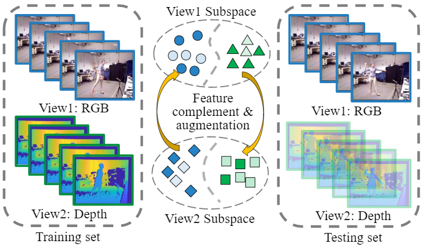
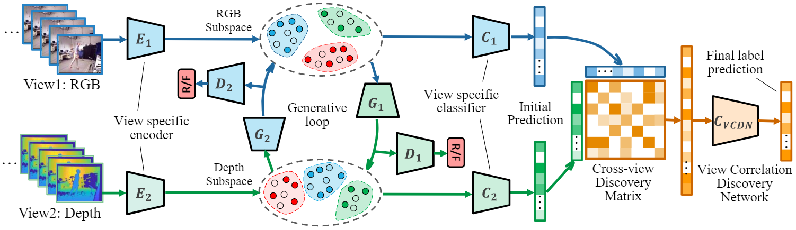

# Generative Multi-View Human Action Recognition
This repository contains code for our International Conference on Computer Vision (ICCV) 2019 paper: [Generative Multi View Human Action Recognition](https://github.com/wanglichenxj/Generative-Multi-View-Human-Action-Recognition/blob/master/representation/ICCV19_MulitView_ActionRecognition.pdf) (GMVAR).

For quick understanding of our work, please also see the [video](https://www.youtube.com/watch?v=8oUPyhwzIDo) which is the presentation in ICCV2019. In addition, Mr. Andre in UCF CRCV group also have a [video](https://www.youtube.com/watch?v=5-AyiRu6lLA) presentation for introducing our work. Feel free to contact us if you have any more questions.

## Introduction
<div align="center">
    
</div>

Multi-view action recognition targets to integrate complementary information from different views to improve classification performance. It is a challenging task due to the distinct gap between heterogeneous feature domains. Moreover, most existing methods neglect to consider the incomplete multi-view data, which limits their potential compatibility in real-world applications.

<div align="center">
    
</div>

In this work, we propose a Generative Multi-View Action Recognition (GMVAR) framework to address the challenges above. The adversarial generative network is leveraged to generate one view conditioning on the other view, which fully explores the latent connections in both intra-view and cross-view aspects. Our approach enhances the model robustness by employing adversarial training, and naturally handles the incomplete view case by imputing the missing data. Moreover, an effective View Correlation Discovery Network (VCDN) is proposed to further fuse the multi-view information in a higher-level label space. Extensive experiments demonstrate the effectiveness of our proposed approach by comparing with state-of-the-art algorithms.

## Code & datasets
### Datasets
The datasets utilized in our experiments are provided in this repository. They are UWA dataset, MHAD dataset and DHA dataset. The RGB and depth features are extracted and saved in the folder ./action_data. It can be extracted and arranged by the code: dataset_loader.py. Other formats of multi-view data could also be evaluated.

### Running the code
We combine all components of our model in a single python file. We run our code in Anaconda environment. We use Tensorflow and please see the code for the detailed package information. After config the environment, input the command below for the demo:
```
python GMVAR_demo.py
```
The demo loads the MHAD dataset and evaluated on single(missing)-view and multi-view settings. "RGB-D" is the multi-view performance. "RGB" is the single RGB view performance. "Depth" is the single depth view performance.

## Authors
Welcome to send us Emails if you have any questions about the code and our work :-)
* **Lichen Wang** [Website](https://sites.google.com/site/lichenwang123/)
* **Zhengming Ding** [Website](http://allanding.net/)
* **Zhiqiang Tao** [Website](http://ztao.cc/)
* **Yunyu Liu** [Website](https://wenwen0319.github.io/)
* **Yun Raymond Fu** [Website](http://www1.ece.neu.edu/~yunfu/)

## Citation
Please cite our paper if you like or use our work for your research, thank you very much!
```
@inproceedings{GMVAR_Lichen,
  title={Generative multi-view human action recognition},
  author={Wang, Lichen and Ding, Zhengming and Tao, Zhiqiang and Liu, Yunyu and Fu, Yun},
  booktitle={Proceedings of the IEEE International Conference on Computer Vision},
  pages={6212--6221},
  year={2019}
}
```


